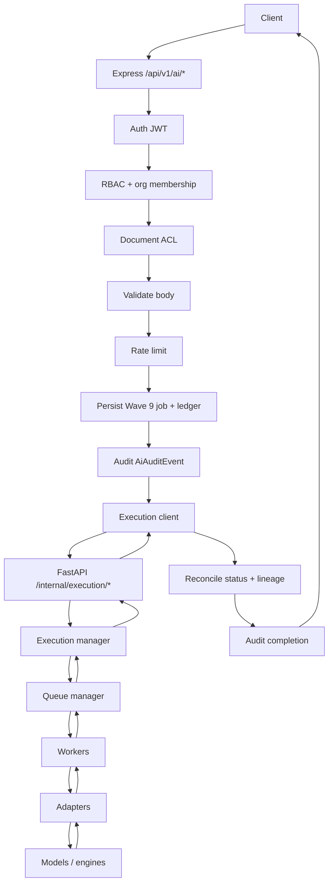

# Express AI Gateway

Public entry for TrustChain AI (Wave 9 + Phase 2). Clients never call FastAPI, workers, or engines directly.

## Request flow

## Responsibilities (Express only)

| Concern | Behavior |
|---------|----------|
| Auth | `requireAuth` on all `/api/v1/ai/*` |
| RBAC | Org membership + document `view` permission |
| Validation | Zod schemas in `validators/schemas.ts` |
| Rate limit | Per-user/org/capability via `assertAiRateLimit` |
| Persistence | Wave 9 job tables + `AiTask` / `AiArtifact` ledger |
| Audit | `AiAuditEvent` on create / submit / state changes |
| Execution | HTTP to FastAPI via `executionClient.ts` |
| Compatibility | Wave 9 job codes ↔ `AI-TASK-*` |

Express **must not** import workers, engines, queue backends, or blockchain/verification modules.

## Public routes

See [`wave9-ai.md`](./wave9-ai.md) for the full route table. Gateway-specific companions:

| Method | Path | Notes |
|--------|------|-------|
| GET | `/api/v1/ai/models` | Adapter-backed catalog (advisory) |
| GET | `/api/v1/ai/health` | Queue / adapter / lease snapshot via execution client |

Org-scoped aliases under `/api/v1/organizations/:id/ai/...`.

## Execution client modes

| Mode | When | Behavior |
|------|------|----------|
| Gateway (HTTP) | `AI_SERVICE_URL` set | Calls FastAPI `/internal/execution/*` with optional bearer token |
| Memory | URL unset **and** non-production | In-process fake client for CI/unit tests only |

Production (`AI_EXECUTION_MODE=production|gateway` or `NODE_ENV=production`) **refuses** memory client and refuses start without URL + token + queue config.

## Sync drain

After submit, Express may call `/internal/execution/drain` so CI and local requests complete synchronously.

- Default: drain enabled
- Disable: `AI_EXECUTION_DRAIN=false` (async workers must be running)

## Security

- Forbidden ops: `assertSafeAiOperation` (revoke, blockchain_tx, mutate_verification, …)
- Every response includes advisory disclaimer; AI is never trust authority
- FastAPI is internal-only; do not expose port 8090 on the public internet

## Related docs

- [`execution.md`](./execution.md) — FastAPI execution API
- [`models.md`](./models.md) — model catalog + result fields
- [`../runbooks/deployment.md`](../runbooks/deployment.md) — startup / config
- [`../runbooks/phase2-ai-queue.md`](../runbooks/phase2-ai-queue.md) — architecture index
