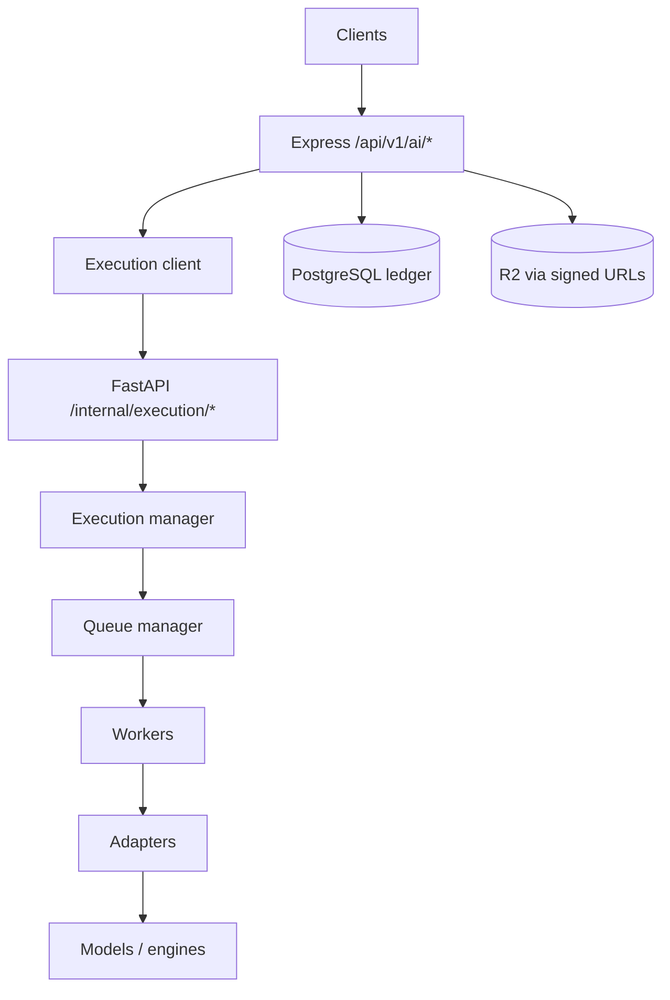

# Wave 9 — AI & OCR Platform

Advisory AI/OCR layer. **Never** a source of truth.

```
Document → R2 → OCR → Extraction → Classification → AI analysis
                → Embeddings / Fraud (advisory)
                → Verification (Wave 4/5 — unchanged authority)
                → Audit (AiAuditEvent + existing logs)
```

**Sources of truth:** PostgreSQL metadata, Cloudflare R2 bytes, blockchain anchors, Wave 4/5 verification reports, audit logs.

## Topology (Phase 2 final)



Redis is ephemeral coordination only (queues, locks, leases, retries). CI may use in-memory queues and an Express memory execution client when `AI_SERVICE_URL` is unset. Production never silently uses memory/stub fallbacks.

Wave 9 v1 job public codes remain; Phase 2 maps them to `AI-TASK-*` via `legacyJobPublicCode`.

### Doc map

| Topic | Doc |
|-------|-----|
| Express gateway | [`gateway.md`](./gateway.md) |
| Execution API | [`execution.md`](./execution.md) |
| Models / result contract | [`models.md`](./models.md) |
| Architecture + ops index | [`../runbooks/phase2-ai-queue.md`](../runbooks/phase2-ai-queue.md) |

## Identifiers

| Kind | Format |
|------|--------|
| OCR job | `OCR-JOB-XXXXXXXX` |
| AI job | `AI-JOB-XXXXXXXX` |
| Embedding job | `EMBEDDING-JOB-XXXXXXXX` |
| Classification job | `CLASSIFICATION-JOB-XXXXXXXX` |
| Lineage | `LINEAGE-XXXXXXXX` |
| Task (Phase 2) | `AI-TASK-XXXXXXXX` |
| Worker | `AI-WORKER-XXXXXXXX` |

## Job states

Wave 9 job rows: `pending` | `processing` | `completed` | `failed` | `cancelled`

Phase 2 queue tasks additionally use: `retrying` | `dead_letter`

## Human review states

`pending_review` | `approved` | `rejected` | `escalated`

AI never auto-finalizes decisions. Default is `pending_review`.

## Confidence & cost (every Express result)

- `confidence` / `confidenceInterval` `{ low, high }`
- `modelVersion` / `evaluationVersion`
- `tokenUsage` / `computeUsage` / `storageUsage` / `estimatedCost`

Adapter layer additionally requires: `advisoryOnly`, `modelId`, `modelVersion`, `executionTimeMs`, `lineageId`, `confidence`.

## Lineage

```
Document → Artifact → Embedding → Inference → Review
```

Tracked via `AiLineage.stepsJson`, `LINEAGE-*`, and worker `AI-ARTIFACT-*` chains.

## APIs (Express gateway)

Auth: Bearer JWT + org membership + document ACL.

| Method | Path |
|--------|------|
| POST | `/api/v1/ai/ocr` |
| POST | `/api/v1/ai/classify` |
| POST | `/api/v1/ai/extract` |
| POST | `/api/v1/ai/search` |
| POST | `/api/v1/ai/fraud` |
| GET | `/api/v1/ai/jobs/:id?organizationId=` |
| GET | `/api/v1/ai/models` |
| GET | `/api/v1/ai/health` |

Org-scoped aliases under `/api/v1/organizations/:id/ai/...` plus:

- `POST .../ai/jobs/:jobId/review`
- `GET .../ai/analytics`

### Example create OCR

```json
{
  "organizationId": "uuid",
  "documentId": "uuid",
  "engine": "stub"
}
```

`engine`: `auto` | `tesseract` | `easyocr` | `paddleocr` | `stub`  
CI uses `stub` when heavy OCR binaries are absent.

## Model management

See [`models.md`](./models.md). Providers: `openai` | `gemini` | `local` | `stub`.

## Explainability

`services/ai/explainability/{evidence,attribution,reasoning,summaries}` — attached as `explanation` / `explanationJson`.

## Policies

`services/ai/policies/{privacy,retention,access,compliance}` — checked before sensitive processing.

## Hard restrictions

AI must never:

- revoke documents
- modify blockchain records
- change Wave 4/5 verification results
- rewrite audit logs
- run autonomous agents
- self-modify prompts
- execute automated blockchain transactions

Enforced in Express (`assertSafeAiOperation`) and FastAPI (`security/guard.py`).

## Env

| Variable | Purpose |
|----------|---------|
| `AI_SERVICE_URL` | FastAPI base URL (**required in production**) |
| `AI_SERVICE_TOKEN` | Service auth token (**required in production**) |
| `AI_EXECUTION_MODE` | `production` / `gateway` / `development` / `test` / `ci` |
| `AI_QUEUE_BACKEND` | `memory` only when explicitly opted in |
| `REDIS_URL` | Queue backend (**required in production** unless memory backend) |
| `AI_ALLOW_STUB_FALLBACK` | Stub adapter slot outside production only |
| `OPENAI_API_KEY` | Optional LLM/embeddings |

Full deploy guide: [`../runbooks/deployment.md`](../runbooks/deployment.md).

## Run AI service

```bash
cd services/ai
pip install -r requirements.txt
PYTHONPATH=. uvicorn api.app:app --port 8090
PYTHONPATH=. pytest
```

## Explicit non-goals

- Autonomous agents
- Self-modifying prompts
- Automated revocation
- Automated blockchain transactions
- Replacing Wave 4/5 as trust authority
