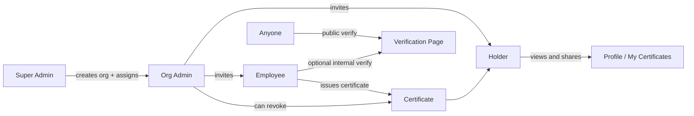

# TrustChain Product Delivery Plan

**Status:** Active — source of truth for finishing the product module-by-module  
**Supersedes:** ad-hoc phase/wave ordering when they conflict with this document  
**Companion docs:** [TrustChain_Specification_Part1.md](../../TrustChain_Specification_Part1.md), [TrustChain_Specification_Part2.md](../../TrustChain_Specification_Part2.md), [IMPLEMENTATION_PLAN.md](../../IMPLEMENTATION_PLAN.md)

---

## How to use this document

1. **Build in slice order** (Slice 0 → 7 for v1). Do not start platform extras (Slice 9+) until v1 demo passes.
2. For each slice, complete every **Definition of Done** checkbox before moving on.
3. Run the **Demo script** manually (backend + web running, real DB).
4. Mark slice status in the [Progress tracker](#progress-tracker) at the bottom.
5. When fixing code, only touch files listed under **Code map** for that slice unless a dependency forces otherwise.

**v1 usable product = Slices 0–7 complete.**

---

## North-star product flow

This is the user story every module must support.



### v1 demo script (full product)

When all of this works without hand-waving, v1 is done:

| Step | Actor | Action | Expected result |
|------|-------|--------|-----------------|
| 1 | Super admin | Create org **Acme Trust**, assign org admin | Org exists; target user has `org_admin` |
| 2 | Org admin | Invite **employee** and **holder** (different roles) | Both receive invitation; accept with correct roles |
| 3 | Employee | Issue certificate to holder (template + PDF) | Cert stored; `recipientUserId` linked; QR embedded |
| 4 | Holder | Log in → **My Certificates** | Sees only their certs; can download PDF |
| 5 | Holder | Copy share / verify link | Public verify page opens |
| 6 | Verifier (no account) | Open link or scan QR | Result: **Verified** |
| 7 | Org admin | Revoke certificate | Verifier sees **Revoked** |
| 8 | Org admin | Open audit | Issue + revoke events logged |

---

## Architecture

### Layer model (build bottom → top)

```
┌──────────────────────────────────────────────────────────────┐
│ L4 Clients     Web (primary) → Mobile → Extension            │
├──────────────────────────────────────────────────────────────┤
│ L3 Trust UX    Certificates · Verification · QR · Wallet   │
├──────────────────────────────────────────────────────────────┤
│ L2 Content     Documents · Templates · Signatures (deferred) │
├──────────────────────────────────────────────────────────────┤
│ L1 Tenancy     Orgs · Roles · Invitations · Provisioning     │
├──────────────────────────────────────────────────────────────┤
│ L0 Foundation  Auth · Security · Storage · Audit base        │
├──────────────────────────────────────────────────────────────┤
│ L5 Platform    Admin ops · Public API · Enterprise · AI      │
│                (after v1 — Slice 9+)                         │
└──────────────────────────────────────────────────────────────┘
```

### Technical trust loop

```
Template/document → content hash → (optional chain anchor) → issue → holder receives → verify (public or staff)
```

**Rules**

- File bytes live in **Cloudflare R2**; Postgres holds metadata and hashes only.
- Chain stores **hash + status + tx id** — never file payloads.
- API enforces authorization; UI capability checks are not a security boundary.

### Stack (locked)

| Concern | Choice |
|---------|--------|
| API | Node.js, Express, `/api/v1` |
| DB | PostgreSQL + Prisma (`packages/database`) |
| Files | Cloudflare R2 |
| Web | React, TypeScript, Tailwind (`apps/web`) |
| Chain | Hardhat + Solidity (`blockchain/`) |
| Email | SMTP (Mailtrap dev / Gmail) |

---

## Role model

| Role key | Persona | Can | Cannot |
|----------|---------|-----|--------|
| `super_admin` | Platform operator | Create/suspend orgs, assign org admins, platform console | Day-to-day cert issuance |
| `org_admin` | Organization operator | Invite employees & holders, branding, templates, revoke certs | Create orgs (v1 policy), platform admin |
| `employee` | Trust operator | Issue certs, bulk issue, internal verify, view org cert registry | Invite org admins, org settings, revoke (v1: defer to org_admin) |
| `public_user` | Holder (org member) | View **own** certs, download PDF, share verify link | Issue certs, see all org certs, admin screens |

### Permission matrix (v1)

| Capability | super_admin | org_admin | employee | holder |
|------------|:-----------:|:---------:|:--------:|:------:|
| Platform admin console | ✓ | | | |
| Create org (provisioned) | ✓ | | | |
| Self-create org | ✓* | | | *Disable for v1 product policy |
| Invite employee | ✓ | ✓ | | |
| Invite holder | ✓ | ✓ | | |
| Manage templates | ✓ | ✓ | | |
| Issue certificate | ✓ | ✓ | ✓ | |
| Revoke certificate | ✓ | ✓ | | ✓ |
| List all org certificates | ✓ | ✓ | ✓ | |
| View own certificates (wallet) | ✓ | ✓ | ✓ | ✓ |
| Public verify | ✓ | ✓ | ✓ | ✓ |

---

## Delivery slices (build order)

Do **not** follow spec module numbers 1–24 sequentially. Follow these slices.

| Slice | Name | Modules | Outcome |
|-------|------|---------|---------|
| **0** | Foundation | M16 | App runs locally with DB, R2, mail, secrets |
| **1** | Identity | M1 | Register, login, sessions, RBAC, `/me` |
| **2** | Provisioning | M2, M14 | Super admin creates org + org admin |
| **3** | Membership | M2 | Org admin invites employee + holder |
| **4** | Issuance | M3 (lite), M7 | Employee issues cert to linked holder |
| **5** | Verify + QR | M5, M6, M4 (optional) | Public verify + QR from cert |
| **6** | Holder wallet | M18 | Holder sees and shares own certs |
| **7** | Notifications | M12 | Email on invite + cert issued + revoke |
| **8** | Observability | M9, M10, M11 | History, audit, basic search |
| **9+** | Platform | M8, M13, M15, M17, M19–24, M20 | After v1 demo passes |

---

## Slice 0 — Foundation (M16 Security + infra)

**Purpose:** Runnable environment and cross-cutting security baseline.

### MVP

- [ ] PostgreSQL + `DATABASE_URL` documented and working
- [ ] Prisma migrate + seed (four roles)
- [ ] Backend starts on port 3001; web on 5173
- [ ] R2 presign upload path works (or dev fallback documented)
- [ ] SMTP sends mail (or dev log fallback)
- [ ] Runtime secrets validated at startup
- [ ] Tenant isolation pattern: all org queries scoped by `organizationId`

### Code map

| Area | Path |
|------|------|
| Backend entry | `apps/backend/src/index.ts`, `apps/backend/src/app.ts` |
| Prisma schema | `packages/database/prisma/schema.prisma` |
| Seed roles | `packages/database/prisma/seed.ts` |
| Config | `packages/config/src/index.ts` |
| Secrets | `apps/backend/src/lib/runtimeSecrets.ts` |
| Startup script | `script.sh` (repo root) |

### Definition of Done

- [ ] `./script.sh` or documented commands start API + web
- [ ] `GET /health` returns 200
- [ ] `npm run test:unit -w @trustchain/backend` passes

### Demo

1. Start stack → health check OK  
2. Seed roles visible in DB  

---

## Slice 1 — Identity (M1 Authentication & Identity)

**Purpose:** Users exist, authenticate, and carry role bindings.

### MVP

- [ ] Register → assigns global `public_user`
- [ ] Login / logout / refresh sessions
- [ ] Email verification + password reset
- [ ] MFA (optional; must not block v1 demo if disabled)
- [ ] `GET /api/v1/me` returns user + roles + memberships
- [ ] RBAC middleware: `requireAuth`, `requireRole`, `userHasRole`

### Phase B (defer)

- Device management polish
- httpOnly cookie sessions (see `docs/web/known-limitations.md`)

### Code map

| Area | Path |
|------|------|
| Auth service | `apps/backend/src/modules/auth/auth.service.ts` |
| RBAC | `apps/backend/src/modules/auth/rbac.repository.ts` |
| Roles | `apps/backend/src/modules/auth/roles.repository.ts` |
| Middleware | `apps/backend/src/middleware/requireAuth.ts`, `requireRole.ts` |
| Me API | `apps/backend/src/modules/me/me.router.ts` |
| Super admin bootstrap | `apps/backend/src/bootstrap/superAdmin.ts` |
| Web auth | `apps/web/src/features/auth/`, `LoginPage.tsx`, `RegisterPage.tsx` |
| Web permissions | `apps/web/src/lib/permissions.ts` |

### Gaps to fix

- [ ] Ensure session bootstrap loads roles before routing gated pages
- [ ] Document `SUPER_ADMIN_EMAIL` in `docs/web/environment.md`

### Definition of Done

- [ ] Register + login + `/me` works in web UI
- [ ] Role bindings visible on Settings page
- [ ] Unit tests for RBAC helpers pass

### Demo

1. Register holder@example.com  
2. Login → Settings shows `public_user`  
3. Set super admin via env → restart → `/admin` accessible  

---

## Slice 2 — Provisioning (M2 + M14)

**Purpose:** Only super admin creates organizations and assigns org admins.

### MVP

- [ ] Super admin creates org via admin API/UI (name, slug, owner user)
- [ ] Owner receives `org_admin` binding + membership
- [ ] **Disable or gate** self-serve `POST /organizations` for v1 (config flag or role check)
- [ ] Super admin can suspend/disable org

### Phase B (defer)

- Branches, departments, hierarchy UI
- Bulk CSV import
- Tenant quotas (keep if already stable; don't expand)

### Code map

| Area | Path |
|------|------|
| Self-serve org create | `apps/backend/src/modules/organizations/organizations.service.ts` → `createOrganizationForUser` |
| Admin tenant create | `apps/backend/src/modules/admin/admin.tenants.ts` → `createTenant` |
| Admin router | `apps/backend/src/modules/admin/admin.router.ts` |
| Web admin tenants | `apps/web/src/pages/AdminTenantsPage.tsx`, `AdminTenantDetailPage.tsx` |
| Web org create | `apps/web/src/pages/OrganizationsPage.tsx` |
| Permissions | `apps/web/src/lib/permissions.ts` → `org.create` |

### Gaps to fix

- [ ] **Policy:** super-admin-only org creation (backend + hide create button for non–super-admin)
- [ ] Admin UI: create org flow assigns existing user by email as org admin
- [ ] Audit log entry on tenant create

### Definition of Done

- [ ] Non–super-admin cannot create org (403)
- [ ] Super admin creates Acme Trust + assigns admin user
- [ ] Assigned user sees org in dashboard with `org_admin`

### Demo

1. Login as super admin  
2. Admin → Tenants → Create **Acme Trust**, owner = admin@example.com  
3. Login as admin@example.com → org visible  

---

## Slice 3 — Membership (M2)

**Purpose:** Org admin onboards employees and holders with distinct roles.

### MVP

- [ ] Org admin invites by email with role: `employee` | `public_user` (holder)
- [ ] Invitation accept flow binds role + membership
- [ ] Member list shows role per user
- [ ] Org admin can disable member (not hard delete)

### Phase B (defer)

- Branches / departments assignment on invite
- Bulk import

### Code map

| Area | Path |
|------|------|
| Invites | `apps/backend/src/modules/organizations/orgStructure.service.ts` → `inviteToOrganization` |
| Router | `apps/backend/src/modules/organizations/organizations.router.ts` |
| Web members | `apps/web/src/pages/OrganizationMembersPage.tsx` |
| Web invitations | `apps/web/src/pages/OrganizationInvitationsPage.tsx` |
| Invite dialog | `apps/web/src/features/organizations/InviteMemberDialog.tsx` (if present) |

### Gaps to fix

- [ ] Invite UI defaults: employee vs holder clearly labeled (not confusing "public user")
- [ ] Accept invitation requires registered email match
- [ ] Employee cannot access org.invite capability

### Definition of Done

- [ ] Org admin invites employee@ and holder@ with correct roles
- [ ] Both accept and land in org with correct role keys
- [ ] Employee sees cert ops nav; holder does not see staff cert registry

### Demo

1. Org admin invites employee + holder  
2. Both register/accept  
3. Roles correct on Settings  

---

## Slice 4 — Issuance (M3 lite + M7 Certificate Generator)

**Purpose:** Employee issues a verifiable certificate to a linked holder.

### MVP

- [ ] Certificate templates (create/edit by org admin; use by employee)
- [ ] Issue certificate: title, recipient name, recipient email, **recipientUserId** when user exists
- [ ] PDF export with placeholders + embedded QR
- [ ] Org staff cert registry (list/detail/history)
- [ ] Optional: link to uploaded document (M3 lite — PDF upload + hash)

### Phase B (defer)

- Drag-and-drop template editor
- Bulk CSV jobs (wire only if already stable)
- Blockchain anchor on issue (Slice 5 optional chain)

### Code map

| Area | Path |
|------|------|
| Cert service | `apps/backend/src/modules/certificates/certificates.service.ts` |
| Issue API | `POST /api/v1/certificates` → `certificates.router.ts` |
| Templates | `certificates.templates.ts`, `CertificateTemplatesPage.tsx` |
| Staff UI | `CertificatesPage.tsx`, `CreateCertificateDialog.tsx`, `CertificateDetailPage.tsx` |
| Documents (lite) | `apps/backend/src/modules/documents/documents.service.ts`, `DocumentsPage.tsx` |
| Placeholders | `certificates.placeholders.ts` |
| Export/render | `certificates.export.ts`, `certificates.renderer.ts` |

### Gaps to fix

- [ ] Issue flow resolves holder by email → sets `recipientUserId`
- [ ] Employee can issue; holder cannot hit issue API (403)
- [ ] Org admin manages templates; employee can issue from active templates
- [ ] Revoke restricted to org_admin (already partially enforced)

### Definition of Done

- [ ] Employee issues cert to holder with template  
- [ ] PDF downloads; QR encodes public verify payload  
- [ ] Cert row has `recipientUserId` populated  

### Demo

1. Login as employee  
2. Certificates → Issue → select holder, template  
3. Download PDF; note public cert ID / QR  

---

## Slice 5 — Verification + QR (M5, M6, M4 optional)

**Purpose:** Anyone can verify authenticity; QR bridges to public verify.

### MVP

- [ ] Public verify: by verification ID, hash, file upload, link token
- [ ] Outcomes: verified, revoked, expired, tampered
- [ ] QR on certificate resolves to public verify
- [ ] Public page works **without login** (`/verify` or `/public/verify`)

### Optional for v1 internal demo

- [ ] Chain anchor on issue/revoke (M4) — required before production "blockchain-backed" claim

### Phase B (defer)

- Dynamic QR analytics dashboard
- Authenticated cross-org employee verify network

### Code map

| Area | Path |
|------|------|
| Public verify API | `apps/backend/src/modules/public-verification/` |
| Public routes | `apps/backend/src/app.ts` → `/api/public` |
| Staff verify | `apps/backend/src/modules/verification/` |
| QR | `apps/backend/src/modules/qr/` |
| Cert verify | `certificates.service.ts` → `verifyCertificateById`, `certificates.verifier.ts` |
| Web public | `PublicVerificationPage.tsx`, `VerificationHashPage.tsx`, `VerificationUploadPage.tsx` |
| Web staff | `VerificationPage.tsx`, `CertificateVerificationPage.tsx` |
| Chain | `apps/backend/src/modules/blockchain/`, `blockchain/` |

### Gaps to fix

- [ ] End-to-end: QR from Slice 4 demo → public page → Verified
- [ ] Revoked cert shows Revoked on public page
- [ ] Remove dependency on staff login for public verify

### Definition of Done

- [ ] Unauthenticated verifier gets correct status from QR/link  
- [ ] Expired cert shows Expired (set short TTL in test)  

### Demo

1. Open QR/link from issued cert (incognito)  
2. See **Verified**  
3. Revoke → refresh → **Revoked**  

---

## Slice 6 — Holder wallet (M18 Digital Wallet)

**Purpose:** Holders view and share **only their** certificates.

### MVP

- [ ] API: `GET /api/v1/me/certificates` (or `/wallet/credentials`) — filter `recipientUserId = current user`
- [ ] API: holder can download own cert PDF (not org-wide list)
- [ ] API: share link / public verify URL for own cert
- [ ] Web: **My Certificates** page or Settings section
- [ ] Web: holder does not see staff `/certificates` org registry

### Phase B (defer)

- Temporary share links with expiry
- Mobile wallet sync (`apps/mobile/src/wallet/`)
- Push notification on new cert

### Code map

| Area | Path |
|------|------|
| Cert list (staff) | `certificates.service.ts` → `listCertificates` (uses `assertOrgStaff`) |
| New holder API | **Add** e.g. `apps/backend/src/modules/wallet/` or extend `me.router.ts` |
| Web settings | `SettingsPage.tsx` |
| New web page | **Add** e.g. `MyCertificatesPage.tsx` + route in `router.tsx` |
| Sidebar | `AppSidebar.tsx` — holder nav vs staff nav |
| Permissions | `permissions.ts` — add `certificates.own.view`, `certificates.own.share` |

### Gaps to fix (largest v1 gap)

- [ ] **New holder-scoped API** (today all cert reads require org staff)
- [ ] **New holder UI** (today no "my certificates")
- [ ] Sidebar/routes: staff see Certificates; holders see My Certificates
- [ ] Share button copies public verify URL

### Definition of Done

- [ ] Holder logs in → sees only certs issued to them  
- [ ] Holder cannot list all org certs (403)  
- [ ] Holder downloads PDF and copies share link  

### Demo

1. Login as holder  
2. My Certificates → see cert from Slice 4  
3. Share link works in incognito  

---

## Slice 7 — Notifications (M12)

**Purpose:** Users get email when something important happens.

### MVP

- [ ] Email: invitation created
- [ ] Email: certificate issued to holder
- [ ] Email: certificate revoked (to holder)
- [ ] In-app notification feed for same events (optional if email works)

### Phase B (defer)

- SMS, push, digest schedules

### Code map

| Area | Path |
|------|------|
| Emit | `apps/backend/src/modules/notifications/notification.emit.ts` |
| Templates | `notification.templates.ts` |
| Mailer | `apps/backend/src/integrations/mailer.ts` |
| Web | `NotificationsPage.tsx` |

### Gaps to fix

- [ ] Ensure cert issue emits to `recipientUserId`
- [ ] Invitation email contains accept instructions / token

### Definition of Done

- [ ] Holder receives email when cert issued (mailtrap/inbox)  

### Demo

1. Issue cert → holder inbox shows notification  

---

## Slice 8 — Observability (M9, M10, M11)

**Purpose:** Operators can audit and review activity.

### MVP

- [ ] Verification history (org staff): who verified what, when, outcome
- [ ] Audit log: login, invite, issue, revoke
- [ ] Basic search: find cert by recipient name or public ID (org staff)

### Phase B (defer)

- Fraud alerts, geo analytics, advanced search admin

### Code map

| Area | Path |
|------|------|
| Verification history | `verification.service.ts`, `VerificationHistoryPage.tsx` |
| Audit | `apps/backend/src/modules/audit/`, `AuditExplorerPage.tsx` |
| Search | `apps/backend/src/modules/search/`, `SearchPage.tsx` |

### Definition of Done

- [ ] Org admin sees issue + revoke in audit  
- [ ] Public verify appears in verification history  

---

## Slice 9+ — Platform expansion (after v1)

**Do not start until v1 demo script passes.**

| Module | Spec | When | Notes |
|--------|------|------|-------|
| M8 Digital Signatures | Part 1 | Post-v1 | Workflows, detached sign |
| M13 Analytics | Part 2 | Post-v1 | Basic counts enough for v1 |
| M14 Admin (advanced) | Part 2 | Post-v1 | Flags, policies, inspection |
| M15 Enterprise | Part 2 | Customer-driven | SSO, SCIM, white-label |
| M17 AI | Part 2 | Optional | OCR assist |
| M19 Extension | Part 2 | After public verify stable | MV3 verify |
| M20 Public API | Part 2 | After v1 | Keys, webhooks |
| M21–22 Mobile | Part 2 | After wallet API | Expo app |
| M23 Integrations | Part 2 | Per customer | HRMS, Drive |
| M24 Reputation | Part 2 | Platform maturity | Trust scores |

**Ignore for v1:** `apps/admin` placeholder modules, marketplace, governance, reputation dashboards unless a slice explicitly needs them.

---

## Module reference (all 24 — structured)

Each module below uses the same template. **MVP** = required for v1; **Phase B** = after v1.

---

### M1 — Authentication & Identity → Slice 1

| | |
|-|-|
| **Purpose** | Authenticate users and expose role bindings |
| **Actors** | All |
| **MVP** | Register, login, logout, refresh, email verify, password reset, MFA optional, RBAC, `/me` |
| **Phase B** | Cookie sessions, advanced device policies |
| **DoD** | See Slice 1 |

---

### M2 — Organization Management → Slices 2–3

| | |
|-|-|
| **Purpose** | Tenancy, membership, invitations |
| **Actors** | super_admin, org_admin |
| **MVP** | Provision org, invite employee/holder, member list, branding |
| **Phase B** | Branches, departments, hierarchy, bulk import |
| **DoD** | See Slices 2–3 |

---

### M3 — Document Management → Slice 4 (lite)

| | |
|-|-|
| **Purpose** | Source files and content hashes for trust objects |
| **Actors** | org_admin, employee |
| **MVP** | PDF/image upload, metadata, version hash, org-scoped download |
| **Phase B** | DOCX, archive, advanced sharing, tags |
| **DoD** | Document attachable to certificate issue flow |

---

### M4 — Blockchain Layer → Slice 5 (optional v1)

| | |
|-|-|
| **Purpose** | Anchor integrity hash on-chain |
| **Actors** | System relayer |
| **MVP** | Hash anchor on issue, status on revoke, tx id in DB |
| **Phase B** | Explorer UI, ownership transfer |
| **DoD** | Verify reads chain state when enabled |

**Note:** Remove "verification engine" from M4 scope — that belongs to M5.

---

### M5 — Verification Engine → Slice 5

| | |
|-|-|
| **Purpose** | Determine authentic / revoked / expired / tampered |
| **Actors** | Public, employee (internal history) |
| **MVP** | Public verify by ID, hash, upload, link; four outcomes |
| **Phase B** | Fraud scoring, geo device analytics |
| **DoD** | See Slice 5 |

---

### M6 — QR System → Slice 5

| | |
|-|-|
| **Purpose** | QR encodes verify entry point |
| **Actors** | employee (create), public (scan) |
| **MVP** | Static QR on cert PDF, downloadable |
| **Phase B** | Dynamic QR, analytics |
| **DoD** | QR scan matches public verify |

---

### M7 — Certificate Generator → Slice 4

| | |
|-|-|
| **Purpose** | Issue credentials to holders |
| **Actors** | org_admin (templates), employee (issue) |
| **MVP** | Templates, issue, PDF, placeholders, QR embed, revoke |
| **Phase B** | Drag-drop editor, batch CSV |
| **DoD** | See Slice 4 |

**Note:** Digital signing workflows belong to M8, not M7.

---

### M8 — Digital Signature System → Slice 9+

| | |
|-|-|
| **Purpose** | Sign documents and approval workflows |
| **MVP for v1** | **Defer** |
| **Phase B** | Requests, multi-sign, approval chains |

---

### M9 — Verification History → Slice 8

| | |
|-|-|
| **Purpose** | Record verify events for org operators |
| **MVP** | List events with outcome, time, method |
| **Phase B** | Fraud alerts, country/device reports |

---

### M10 — Audit System → Slice 8

| | |
|-|-|
| **Purpose** | Immutable activity trail |
| **MVP** | Login, invite, issue, revoke |
| **Phase B** | Full explorer, export |

---

### M11 — Search Engine → Slice 8

| | |
|-|-|
| **Purpose** | Find certs/documents within org |
| **MVP** | Search by name, public ID, recipient |
| **Phase B** | Cross-entity smart search |

---

### M12 — Notification System → Slice 7

| | |
|-|-|
| **Purpose** | Notify users of trust events |
| **MVP** | Email: invite, cert issued, revoked |
| **Phase B** | SMS, push, digest |

---

### M13 — Analytics Platform → Slice 9+

| | |
|-|-|
| **MVP for v1** | Dashboard stat cards only |
| **Phase B** | Trends, heat maps, fraud reports |

---

### M14 — Administration Platform → Slice 2

| | |
|-|-|
| **Purpose** | Platform operator console |
| **MVP** | Create/suspend org, assign org admin |
| **Phase B** | Chain monitor, storage quotas, flags |

---

### M15 — Enterprise → Slice 9+

| | |
|-|-|
| **MVP for v1** | **Defer** |
| **Phase B** | SSO, LDAP, SCIM, white-label, custom domains |

---

### M16 — Security Layer → Slice 0

| | |
|-|-|
| **Purpose** | Cross-cutting security (build first, not last) |
| **MVP** | Argon2, JWT sessions, tenant isolation, R2 presign, secrets |
| **Phase B** | IP restrictions, malware scan, DR |

---

### M17 — AI Layer → Slice 9+

| | |
|-|-|
| **MVP for v1** | **Defer** |
| **Phase B** | OCR, fraud hints, smart search |

---

### M18 — Digital Wallet → Slice 6

| | |
|-|-|
| **Purpose** | Holder credential portfolio |
| **Actors** | holder (primary), all roles for own certs |
| **MVP** | My certificates, download, share link |
| **Phase B** | Temp links, mobile sync, push |
| **DoD** | See Slice 6 — **critical v1 gap** |

---

### M19 — Browser Extension → Slice 9+

| | |
|-|-|
| **MVP for v1** | **Defer** |
| **Phase B** | MV3 public verify, QR detect |

---

### M20 — Public API → Slice 9+

| | |
|-|-|
| **MVP for v1** | **Defer** |
| **Phase B** | API keys, rate limits, webhooks, SDK |

---

### M21 / M22 — Mobile → Slice 9+

| | |
|-|-|
| **MVP for v1** | **Defer** (web wallet first) |
| **Phase B** | Dashboard, wallet, scanner |

---

### M23 — Integrations → Slice 9+

| | |
|-|-|
| **MVP for v1** | **Defer** |
| **Phase B** | HRMS, email, cloud storage |

---

### M24 — Reputation Engine → Slice 9+

| | |
|-|-|
| **MVP for v1** | **Defer** |
| **Phase B** | Trust/risk/fraud scores |

---

## Codebase alignment summary

| Slice | Backend | Web | Status |
|-------|---------|-----|--------|
| 0 | Infra, prisma, app | Vite app | Mostly done — ensure runnable |
| 1 | auth, me, rbac | login, register, settings | Done — polish |
| 2 | admin.tenants, org create | AdminTenants, Organizations | **Gap:** self-serve org open |
| 3 | orgStructure invites | Members, Invitations | Done — UX labels |
| 4 | certificates.* | Certificates*, templates | Done — link recipientUserId |
| 5 | public-verification, qr | PublicVerification* | Mostly done — wire demo |
| 6 | **missing holder API** | **missing My Certificates** | **Major gap** |
| 7 | notification.emit | Notifications | Partial — wire cert events |
| 8 | audit, search, verification history | Admin/audit pages | Built early — validate after v1 path |
| 9+ | many modules | many pages | **Pause** until v1 |

---

## Explicit non-goals for v1

- Self-serve organization signup (any user creates org)
- Holder access to org-wide certificate registry
- Digital signature approval workflows
- Enterprise SSO / SCIM
- Mobile app parity
- AI OCR
- Marketplace, governance, reputation UIs
- `apps/admin` placeholder app as product surface (use `apps/web` `/admin` only)

---

## Progress tracker

Update this table as slices complete.

| Slice | Status | Completed date | Notes |
|-------|--------|----------------|-------|
| 0 Foundation | ✅ Done | 2026-08-19 | Stack runs via script.sh |
| 1 Identity | ✅ Done | 2026-08-19 | Existing auth/RBAC; no changes needed |
| 2 Provisioning | ✅ Done | 2026-08-19 | Super-admin-only org create (backend + web) |
| 3 Membership | ✅ Done | 2026-08-19 | Holder vs employee invite labels |
| 4 Issuance | ✅ Done | 2026-08-19 | Auto-link recipientUserId from email |
| 5 Verify + QR | ✅ Done | 2026-08-19 | Public GET /api/public/certificates/verify/:publicId + web page |
| 6 Holder wallet | ✅ Done | 2026-08-19 | GET /me/certificates + My Certificates UI |
| 7 Notifications | ✅ Done | 2026-08-19 | Holder emails on issue/revoke; improved invite email; worker enabled in dev |
| 8 Observability | ✅ Done | 2026-08-19 | Audit on issue/revoke/login/invite; cert search index; public verify in history |
| v1 demo | ⬜ Not started | | Run north-star script end-to-end |

**Status key:** ⬜ Not started · 🔄 In progress · ✅ Done

---

## Next action

Start with **Slice 0** (confirm stack runs), then **Slice 2** (provisioning policy) and **Slice 6** (holder wallet) — the two gaps that most block a coherent product story.

When implementing a slice, open a task titled `Slice N: <name>` and work only through that slice's **Gaps to fix**, **Definition of Done**, and **Demo** sections.
