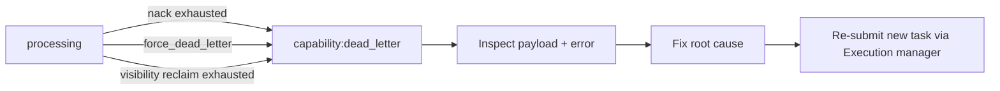

# Dead-letter recovery

Dead-letter queues (DLQs) hold tasks that exhausted retries or were force-dead-lettered.

## Naming

| Primary queue | DLQ |
|---------------|-----|
| `ocr` | `ocr:dead_letter` |
| `classification` | `classification:dead_letter` |
| `extraction` | `extraction:dead_letter` |
| `embedding` | `embedding:dead_letter` |
| `fraud` | `fraud:dead_letter` |
| `evaluation` | `evaluation:dead_letter` |

## Dead-letter flow

## Inspection

1. Health snapshot: `dlq` depths / `deadLetterCount` metrics.
2. Redis: list key for `{queue}:dead_letter` (prefix `tc:ai`).
3. Task meta: status `dead_letter` + `error` field.
4. Express: job row `failed` / audit `ai.execution.*` events with task mapping.

## Recovery procedure

1. **Do not** silently re-push corrupted payloads without review.
2. Capture `task_id`, `legacy_job_public_code`, `error`, payload excerpt, attempt count.
3. Fix underlying issue (adapter outage, bad input, model validation).
4. Submit a **new** task via Execution manager / Express API (new `AI-TASK-*`).
5. Optionally mark original Wave 9 job failed with operator notes in audit.

Replay automation is intentionally out of scope — DLQ is an operator surface, not auto-retry infinity.

## Related

- [`retry-management.md`](./retry-management.md)
- [`troubleshooting.md`](./troubleshooting.md)
- [`disaster-recovery.md`](./disaster-recovery.md)
