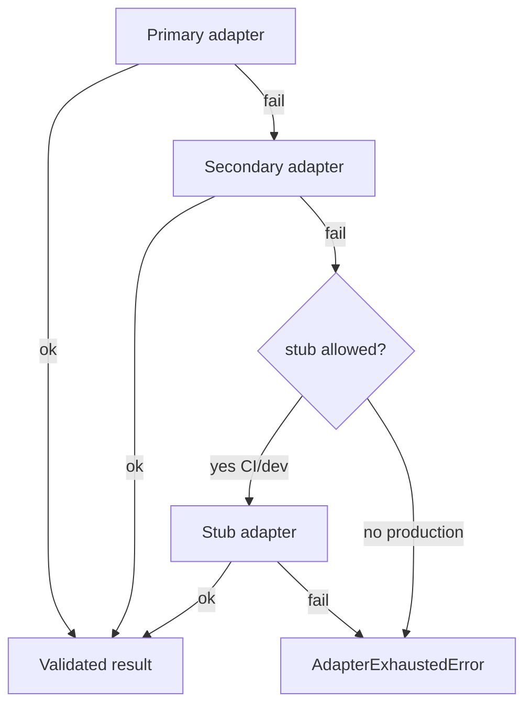

# AI disaster recovery

Redis and in-memory queues are **ephemeral**. Sources of truth remain PostgreSQL, R2, blockchain anchors, Wave 4/5 verification, and audit logs.

## Failure domains

| Domain | Impact | Recovery |
|--------|--------|----------|
| Redis loss | Queue/lease/DLQ depth lost | Restore Redis; re-submit incomplete jobs from Postgres ledger (`AiTask` / Wave 9 jobs still `processing`) |
| FastAPI down | Express returns 502/503 | Restart AI service; health must go green before traffic |
| Express down | Public AI unavailable | Standard API restore; no FastAPI exposure needed |
| Worker crash | Inflight → visibility timeout → retry/DLQ | Restart workers; reclaim expired; inspect DLQ |
| Adapter/provider outage | Fallback chain / exhaustion | Fix provider; see fallback docs; DLQ recovery for exhausted tasks |
| Poison payload | Repeated DLQ | Quarantine; fix input; new task id |

## Recovery procedures

### A. Redis wipe / failover

1. Bring Redis (or replica) online; set `REDIS_URL`.
2. Restart FastAPI workers so leases re-acquire.
3. Query Postgres for AI jobs / `AiTask` rows stuck in `processing` / `pending`.
4. Re-submit via Express APIs (new `AI-TASK-*`); link via `legacyJobPublicCode`.
5. Audit the recovery actions.

### B. Region / process crash mid-drain

1. On restart, run `reclaim_expired` per queue (or allow WorkerManager cycles).
2. Inspect DLQ depths.
3. Confirm Express `AI_SERVICE_URL` points at healthy AI.

### C. Data integrity note

Never treat queue payloads or AI results as authoritative trust outcomes. Re-run verification (Wave 4/5) if a human workflow depends on document trust — AI remains advisory.

## Fallback flow (adapters)

## Related

- [`dead-letter-recovery.md`](./dead-letter-recovery.md)
- [`deployment.md`](./deployment.md)
- [`phase2-ai-queue.md`](./phase2-ai-queue.md)
