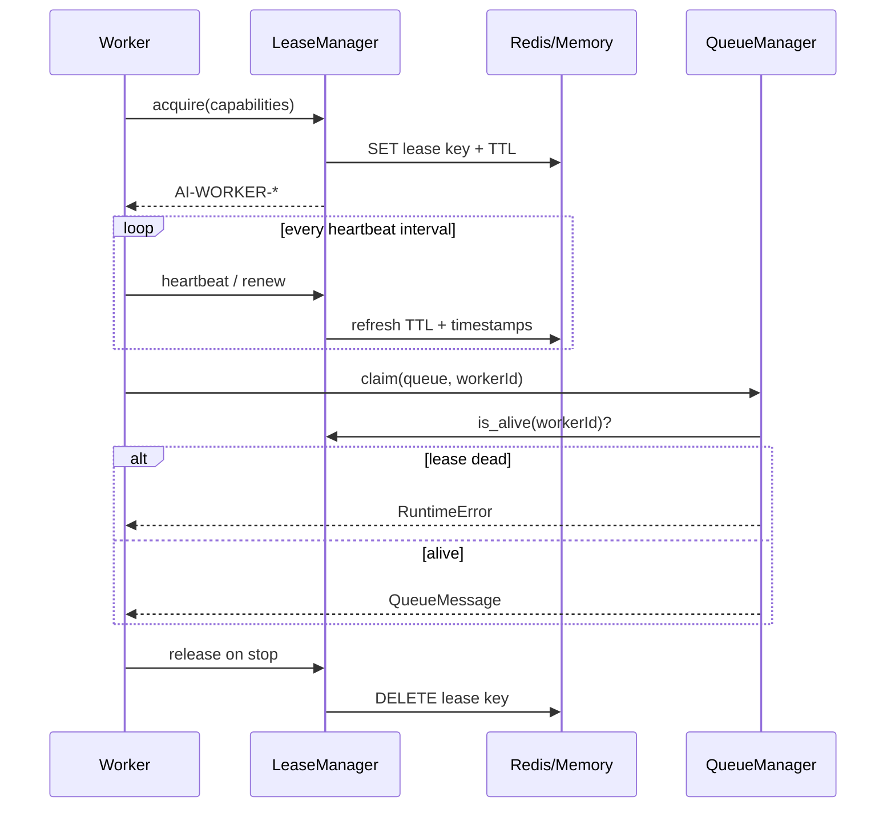

# Lease management

Worker leases prevent claim without a live worker and enable reclaim on failure.

## Defaults

| Setting | Default |
|---------|---------|
| Lease TTL | 60_000 ms |
| Heartbeat interval | 15_000 ms |
| Lock TTL (claim/reclaim) | 30_000 ms |

Configured via `task_queue/names.py` / `@trustchain/config` `AiQueueDefaults`.

## Lease lifecycle

## Fields

| Field | Meaning |
|-------|---------|
| `workerId` | `AI-WORKER-XXXXXXXX` |
| `leaseExpiration` | Absolute expiry timestamp |
| `heartbeatTimestamp` | Last successful renew |
| `lastSeenAt` | Last activity |
| `capabilities` | Queues this worker may claim |

## Expiration behavior

- Expired / missing lease → `claim` raises; worker must re-acquire.
- Metrics may record `leaseExpirations`.
- Processing messages whose visibility timeout elapses are reclaimed (`reclaim_expired`) → retry or DLQ.

## Inspection

1. `GET /internal/execution/health`
2. Worker `leases.snapshot(workerId)`
3. Redis keys under `tc:ai` lease prefix (when using Redis)

## Related

- [`worker-operations.md`](./worker-operations.md)
- [`troubleshooting.md`](./troubleshooting.md)
