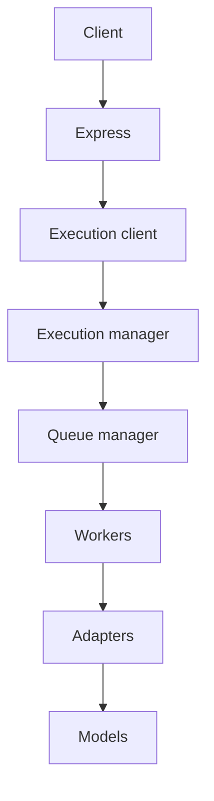

# Phase 2 — AI architecture & operations index

Final architecture after Steps 1–8 (consolidation complete for docs/ops; Step 9+ not started).

## Request flow (canonical)

Stub adapter slot: **CI / local only**. Production never silently falls back to stub or Express memory client.

## Component map

| Layer | Path | Doc |
|-------|------|-----|
| Express gateway | `apps/backend/src/modules/ai/` | [`../api/gateway.md`](../api/gateway.md) |
| Execution API | `services/ai/api/routers/execution.py` | [`../api/execution.md`](../api/execution.md) |
| Execution manager | `services/ai/execution/` | [`../api/execution.md`](../api/execution.md) |
| Queue manager | `services/ai/task_queue/` | [`../api/execution.md`](../api/execution.md) |
| Workers | `services/ai/workers/` | [`worker-operations.md`](./worker-operations.md) |
| Leases / heartbeats | `task_queue/leases`, `workers/heartbeat` | [`lease-management.md`](./lease-management.md) |
| Retries / timeouts | `workers/retry_manager`, `timeout_manager` | [`retry-management.md`](./retry-management.md) |
| DLQ | `{queue}:dead_letter` | [`dead-letter-recovery.md`](./dead-letter-recovery.md) |
| Adapters / fallback | `services/ai/adapters/` | [`disaster-recovery.md`](./disaster-recovery.md) |
| Models | `services/ai/models/` | [`../api/models.md`](../api/models.md) |
| Metrics | `workers/metrics.py` | [`metrics.md`](./metrics.md) |
| Deploy / DR / debug | — | [`deployment.md`](./deployment.md), [`disaster-recovery.md`](./disaster-recovery.md), [`troubleshooting.md`](./troubleshooting.md) |
| Dead-code audit | — | [`phase2-ai-dead-code-audit.md`](./phase2-ai-dead-code-audit.md) |

## Diagrams (see linked runbooks)

| Diagram | Location |
|---------|----------|
| Request flow | this page + [`../api/gateway.md`](../api/gateway.md) |
| Worker lifecycle | [`worker-operations.md`](./worker-operations.md) |
| Lease lifecycle | [`lease-management.md`](./lease-management.md) |
| Retry flow | [`retry-management.md`](./retry-management.md) |
| Dead-letter flow | [`dead-letter-recovery.md`](./dead-letter-recovery.md) |
| Lineage flow | [`troubleshooting.md`](./troubleshooting.md) |
| Fallback flow | [`disaster-recovery.md`](./disaster-recovery.md) |

## Step history

| Step | Focus | Status |
|------|-------|--------|
| 1 | Inspection | complete |
| 2 | Queue | complete |
| 3 | Workers | complete |
| 4 | Adapters | complete |
| 5 | Express gateway | complete |
| 6 | Stub removal / single path | complete |
| 7 | Testing & hardening | complete |
| 8 | Documentation & operational readiness | complete |
| 9 | Release audit | **complete** |

## Production configuration (required)

`AI_SERVICE_URL` · `AI_SERVICE_TOKEN` · `AI_EXECUTION_MODE` · `REDIS_URL` **or** `AI_QUEUE_BACKEND=memory`

## Security (summary)

- RBAC + document ACL on Express
- Audit logging (`AiAuditEvent`)
- Advisory-only results (`advisoryOnly=true`)
- FastAPI private / isolated
- Startup configuration validation
- No blockchain or verification mutation from AI paths

## Phase 2 status

Phase 2 AI consolidation Steps 1–9 are complete. See [`phase2-ai-release-audit.md`](./phase2-ai-release-audit.md) for scores, checklist, and limitations.
