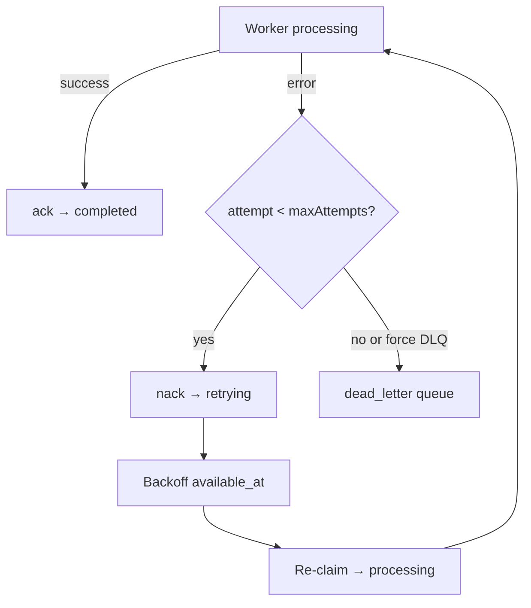

# Retry management

How failed AI tasks move through retry and exhaustion.

## Task states

`pending` → `processing` → `completed`  
        ↳ `retrying` → `processing` …  
        ↳ `failed` | `cancelled` | `dead_letter`

## Retry flow

## Defaults

| Setting | Default |
|---------|---------|
| `maxAttempts` | 3 |
| Visibility timeout | 120_000 ms |
| Backoff | Exponential (`retry_delay_seconds`) capped |

## Components

| Module | Role |
|--------|------|
| `workers/retry_manager.py` | Decide retry vs dead_letter |
| `workers/timeout_manager.py` | Execution timeout + reclaim |
| `workers/state_machine.py` | Legal transitions only |
| `task_queue/manager.py` | `nack` / `dead_letter` / `reclaim_expired` |

## Cancellation

`POST /internal/execution/cancel/{taskId}` (or ExecutionManager.cancel) sets `cancelled`. Terminal — do not resume without a new submit.

## Related

- [`dead-letter-recovery.md`](./dead-letter-recovery.md)
- [`lease-management.md`](./lease-management.md)
