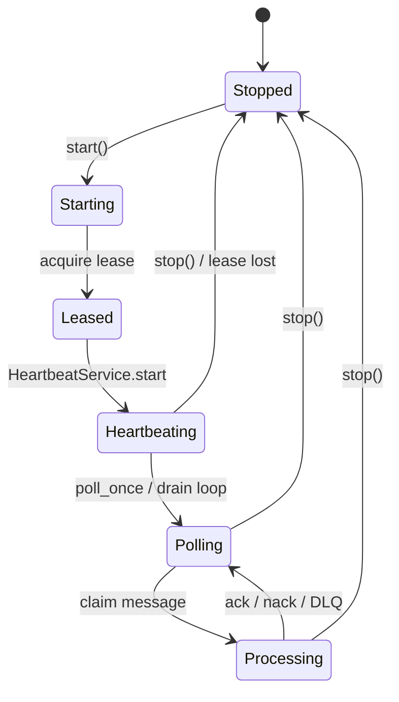

# Worker operations

Operational guide for Phase 2 AI workers under `services/ai/workers/`.

## Worker lifecycle

## Capabilities

One worker (or drain slot) per queue:

`ocr` | `classification` | `extraction` | `embedding` | `fraud` | `evaluation`

Executors call **adapters only** — never engine modules directly.

## Startup

1. Ensure Redis (or memory backend) is reachable.
2. Start FastAPI: `PYTHONPATH=. uvicorn api.app:app --port 8090`
3. Workers may run:
   - **In-process drain** via `POST /internal/execution/drain` (CI / Express sync path), or
   - **Long-running** `WorkerManager.start_all()` in a dedicated process (ops deployment).

Express should set `AI_SERVICE_URL` and, for async mode, `AI_EXECUTION_DRAIN=false`.

## Shutdown

1. Stop accepting new submits (scale Express / flip drain off carefully).
2. Call worker `stop()` / `stop_all()` — releases leases, joins heartbeat threads.
3. Drain remaining visibility-timeout reclaim if needed.
4. Stop FastAPI process.

## Inspection

| Check | How |
|-------|-----|
| Worker count / metrics | `GET /internal/execution/health` → `execution` / adapter health; WorkerManager `health()` |
| Lease alive | Lease snapshot: `workerId`, `leaseExpiration`, `heartbeatTimestamp`, `lastSeenAt` |
| Queue depth | Health `queues` map per capability |
| Task status | `GET /internal/execution/tasks/{taskId}` or Express `GET /api/v1/ai/jobs/:id` |

## Rules

- Workers never import blockchain, verification, Express, or frontend packages.
- Results must remain `advisoryOnly=true`.
- Prefer reclaim + retry over silent drop when leases expire.

## Related

- [`lease-management.md`](./lease-management.md)
- [`retry-management.md`](./retry-management.md)
- [`metrics.md`](./metrics.md)
