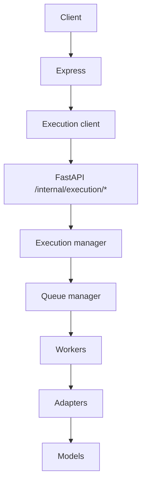

# TrustChain AI Service

Advisory-only AI/OCR microservice (Wave 9 + Phase 2 consolidation).

Never revokes certificates, executes blockchain transactions, mutates verification results, runs autonomous agents, or self-modifies prompts.

## Final architecture



Express is the only public gateway. This service must stay on a private network.

## Layout

| Path | Role |
|------|------|
| `api/` | FastAPI app + `/internal/*` routers |
| `execution/` | Execution manager |
| `task_queue/` | Queue manager (not named `queue/` — avoids stdlib shadow) |
| `workers/` | Pool, leases, heartbeat, retry, timeout, lineage, metrics, executors |
| `adapters/` | Clients + primary → secondary → stub\* fallback |
| `models/` | Registry, routing, versions, benchmarks |
| `ocr/`, `extraction/`, `classification/`, `embeddings/`, … | Engines used **via adapters** |
| `security/` | Advisory-only operation guards |

\* Stub fallback: local/CI only.

## Run API

```bash
cd services/ai
pip install -r requirements.txt
PYTHONPATH=. uvicorn api.app:app --reload --port 8090
```

- Health: `GET /health`
- Execution: `/internal/execution/{submit,tasks,cancel,drain,health,models}`
- Engine helpers: `/internal/{ocr,extract,classify,search,fraud,embed,evaluate,explain,pipeline}`

## Run tests

```bash
PYTHONPATH=. pytest
```

## Configuration

See [`docs/runbooks/deployment.md`](../../docs/runbooks/deployment.md).

Required in production: `AI_SERVICE_URL` (on Express), `AI_SERVICE_TOKEN`, `REDIS_URL` or explicit `AI_QUEUE_BACKEND=memory`, `AI_EXECUTION_MODE=production`.

## Documentation index

- [`docs/api/wave9-ai.md`](../../docs/api/wave9-ai.md) — public AI API
- [`docs/api/gateway.md`](../../docs/api/gateway.md) — Express gateway
- [`docs/api/execution.md`](../../docs/api/execution.md) — execution API
- [`docs/api/models.md`](../../docs/api/models.md) — model contract
- [`docs/runbooks/phase2-ai-queue.md`](../../docs/runbooks/phase2-ai-queue.md) — architecture index
